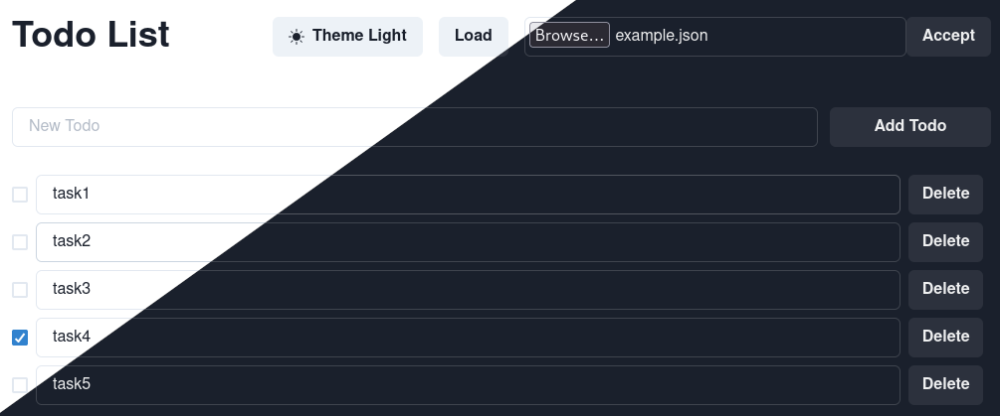

# Todo
A Todo app made to compare different state managers such as [Zustand](https://docs.pmnd.rs/zustand/getting-started/introduction), [Redux](https://redux.js.org/), and [Easy Peasy](https://easy-peasy.dev/).


[Demo site](https://todos-nanob0tt.netlify.app/)

## Main branch (zustand branch)

1. Clone the repository.
2. Install dependencies.
```
npm install
```

3. execute the app in Dev mode.
```
npm run dev
```

* If you want to see other approaches, select the branch with the state manager that you prefer.
* If you want to run other approaches do: ```git checkout name-of-the-branch``` and then follow steps 2 and 3.
